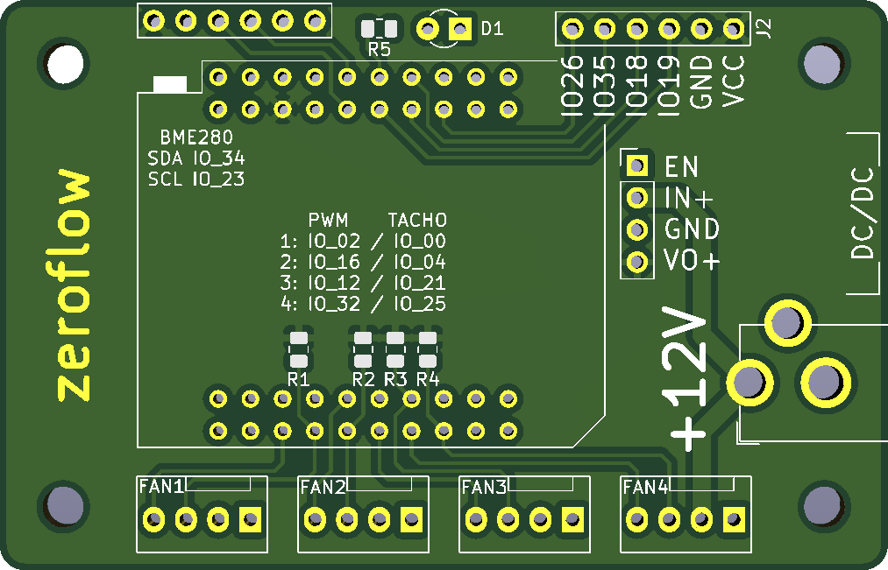

# ESP32 Tasmota-Fancontroller

## THIS MODULE HAS NOT YET BEEN BUILT, WORK IN PROGRESS
 
4x PWM Fan Output (3 Pin Fan Control not supported)
1x BME280 Header
1x Spare Header (3V3, GND, 4x IO)

## Tasmota Config

* Individual PWM Channel control
* Gamma correction OFF (0..100 = 0%..100% PWM, by default, Tasmota uses a [Gamma Table](https://tasmota.github.io/docs/Lights/#gamma-correction))

`Backlog Setoption68 1; LedTable 0`

## Tasmota32 Template

`{"NAME":"ESP32-Fancontroller","GPIO":[352,0,416,0,353,0,0,0,418,0,0,0,417,0,1,1,0,354,0,608,0,355,1,0,0,0,0,0,419,544,640,1,0,0,0,0],"FLAG":0,"BASE":1}`

| Function   | Pin |
| --------   | --- |
| Sense1     | IO_00 |
| PWM1       | IO_02 |
| Sense2     | IO_04 |
| PWM3       | IO_12 |
| PWM2       | IO_16 |
| Spare      | IO_18 |
| Spare      | IO_19 |
| Sense3     | IO_21 |
| BME280 SCL | IO_23 |
| Sense4     | IO_25 |
| Spare      | IO_26 |
| PWM4       | IO_32 |
| Link       | IO_33 |
| BME280 SDA | IO_34 |
| Spare      | IO_35 |
